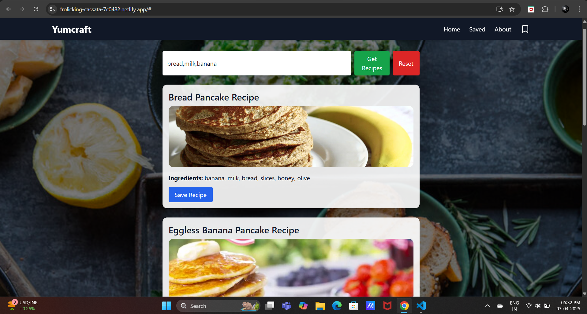

# 🍽️ Yumcraft Frontend

Yumcraft is a smart recipe recommendation app that lets users input ingredients and get delicious recipe suggestions. This is the **React-based frontend**, styled with **Tailwind CSS** and animated using **Framer Motion**.

🌐 **Backend API:** [https://yumcraft-backend.onrender.com](https://yumcraft-backend.onrender.com)

---

## 🚀 Getting Started

### Clone the Repository

```bash
git clone https://github.com/your-username/yumcraft-frontend.git
cd yumcraft-frontend
```
### Install Dependencies
- Make sure you have Node.js and npm installed.

```bash
npm install
```
### Start the Development Server
```bash
npm start
```
- Open http://localhost:3000 in your browser to see the app running.

## 🌐 Connect to Backend
- This frontend works with the Yumcraft Backend API. You can:
    - Run the backend locally at http://localhost:5000
    - Or use the deployed version at https://yumcraft-backend.onrender.com

- Update the API URL in App.js if needed:

```js
const response = await axios.post('https://yumcraft-backend.onrender.com/recommend', {
  ingredients: ingredients.split(',').map((i) => i.trim()),
});
```

##  ✨ Features
- 📝 Enter comma-separated ingredients
- 🍽️ Get top 5 recipe recommendations
- 💾 Save favorite recipes
- 🖼️ View images and ingredients
- ⚡ Smooth UI with Framer Motion
- 🔔 Toast notifications using React Hot Toast

## 📜 Available Scripts
- Run the following scripts in the project directory:
```
npm start
```
- Runs the app in development mode. Open http://localhost:3000
```
npm test
```
- Launches the test runner in interactive watch mode.
```
npm run build
```
- Builds the app for production in the build folder.
```
npm run eject
```
- ⚠️ Use only if you need to customize configurations. This is a one-way operation.

## 📂 Deployment
- To deploy this app:
- Run the build script:
```bash
npm run build
```
- Deploy the build/ folder using any platform:
  - Vercel
  - Netlify
  - Render (Static Hosting)

## 🧠 Learn More
- React
- Tailwind CSS
- Framer Motion
- Axios
- React Hot Toast

## 📸 Screenshots


## 👤 Author
Anshul Chaudhary
GitHub: @anshul-3000
